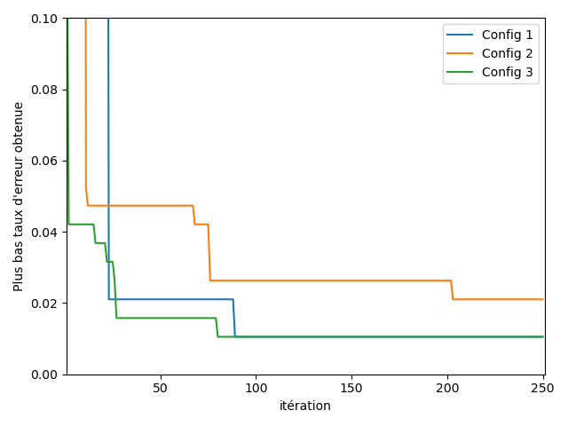
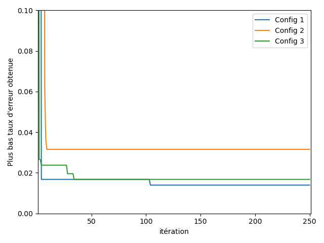

# HyperPara
An heterogeneous optimization library

## Requirements

The present package is written in **Python 3.7**. In order to run a full capacity, the user should have a **Nvidia GPU** with **CUDA 10.1** installed. Also, the following HPO package are required to execute our test.
```
-GPyOpt 
-HyperOpt 
-mpi4py
-Scikit-Learn
-Pytorch
```

## Usage
### Tuning algorithms
The tuning can be done with the following hyperparameter optimization methods :
```
- random_search      
- gaussian_process  # 2 possible variants : (GP, GP_MCMC), 3 possible acquisition functions : (EI, MPI, LCB)
- tpe
```

### Example of usage
Each hyperparameter search space will be defined with the help of the following domain objects

- ```ContinuousDomain(lower_bound, upper_bound, log_scaled=False)```
- ```DiscreteDomain(list_of_values)```

Here's a detailed example on how to use the methods available 
```
from Optimizer.Domain import ContinuousDomain, DiscreteDomain
from Scheduler.Scheduler import tune_objective
```
Your need to create your own objective function
```
objective = create_objective_func("iris")
```
```
h_space = {
    "lr": ContinuousDomain(-7, -1),
    "alpha": ContinuousDomain(-7, -1),
    "b_size": DiscreteDomain(np.arange(50, 500, 10).tolist()),
    "num_layer": DiscreteDomain(np.arange(1, 20, 1).tolist())
}
```
```
optim_list = ["GP", "GP", "tpe"]
acq_list = ["EI", "MPI"]
device_list = ["cuda:0", "cuda:1"]
path = "Result/BreastCancer/Setting1/"
```
```
num_iters = 250
```
```
tune_objective(objective_func=objective,
               h_space=h_space,
               optim_list=optim_list,
               acq_func_list=acq_list,
               num_iters=num_iters,
               device_list=device_list,
               save_path=path,
               save_each_iter=False,
               verbose=True)
 ```
 
 ## Results from our experimentation
 We used the following optimizer configuration
 ```
-Config 1: GP(EI), GP(MPI) and TPE
-Config 2: TPE
-Config 3: GP(EI)
```
### IRIS



<b> Model: SVM </b> <p></p>

| Hyperparameter | Distribution | Min | Max | Step |
| --- | --- | --- | --- | --- |
|C | Log-Uniform | 1e-7| 1e0| N/A|
|Gamma | Log-Uniform | 1e-7| 1e0| N/A|     

<br/><br/>
### Breast Cancer Wisconsin



<b> Model: Multi Layer Perceptron </b> <p></p>

| Hyperparameter | Distribution | Min | Max | Step |
| --- | --- | --- | --- | --- |
|Learning rate | Log-Uniform | 1e-8| 1e0| N/A|
|L2 regularization | Log-Uniform | 1e-8| 1e0| N/A|
|Batch size | Discrete | 50| 500| 10|
|# Layer | Discrete | 1| 50| 1|  
|Layer size | Discrete | 20| 100| 1|

<br/><br/>
### CIFAR-10


<b> Model: Multi Layer Perceptron </b> <p></p>

| Hyperparameter | Distribution | Min | Max | Step |
| --- | --- | --- | --- | --- |
|Learning rate | Log-Uniform | 1e-7| 1e1| N/A|
|L2 regularization | Log-Uniform | 1e-7| 1e-1| N/A|
|Momentum | Uniform | 0.1| 0.9| N/A|
|Dropout Max | Uniform | 0| 0.5| N/A|
|Batch size | Discrete | 50| 300| 10|
|Mixup 0 | Uniform | 0| 3.0| N/A| 
|Mixup 1 | Uniform | 0| 3.0| N/A| 
|Mixup 2 | Uniform | 0| 3.0| N/A| 
|Mixup 3 | Uniform | 0| 3.0| N/A| 
|$T_0$ | Discrete | 10| 100| 150|
